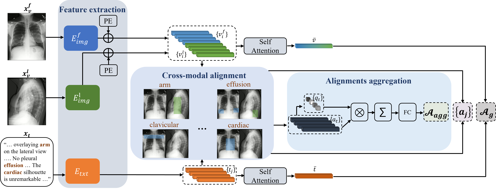

# LIMITR: Leveraging Local Information for Medical Image-Text Representation
LIMITR is a multi-modal representation learning model for chest X-ray images and reports.  
The model is based on a novel alignment scheme between the visual data and the text, which takes into account both local and global information. 
Furthermore, the model integrates domain-specific information of two types -- lateral images and the consistent visual structure of chest images.
Our representation is shown to benefit three types of retrieval tasks: text-image retrieval, class-based retrieval, and phrase-grounding.

> [LIMITR manuscript](https://openaccess.thecvf.com/content/ICCV2023/papers/Dawidowicz_LIMITR_Leveraging_Local_Information_for_Medical_Image-Text_Representation_ICCV_2023_paper.pdf) <br>
> Gefen Dawidowicz, Elad Hirsch, Ayellet Tal <br> 
> Technion – Israel Institute of Technology <br>
> Proceedings of the IEEE/CVF International Conference on Computer Vision (ICCV), 2023 <br>



## Installation
We used Python 3.8 with pytorch 1.11 

To clone this repository:
```shell
git clone https://github.com/gefend/LIMITR.git
```

To install Python requirements:
```shell
pip install -r requirements.txt
```

## Data

1. Download MIMIC-CXR dataset [MIMIC-CXR](https://physionet.org/content/mimic-cxr-jpg/2.0.0/).
2. Update the path to MIMIC directory (`DATA_BASE_DIR`) on `./LIMITR/constants.py`.
3. Extract the file `mimic_csv.tar.gz` into a `mimic_csv` directory.
4. The splits we used for evaluation and training are available on the `./mimic_csv` directory.

## Training 
Update the desired training configuration on `./configs/mimic_config.yaml`

Train the model with the following command:

```bash
python run.py -c ./configs/mimic_config.yaml --train
```

Test the model with the following command:

```bash
python run.py -c ./configs/mimic_config.yaml --test ---ckpt_path=ckpt_path
```
Update `ckpt_path` with the desired checkpoint for evaluation. 

## Citation
```
@InProceedings{Dawidowicz_2023_ICCV,
    author    = {Dawidowicz, Gefen and Hirsch, Elad and Tal, Ayellet},
    title     = {LIMITR: Leveraging Local Information for Medical Image-Text Representation},
    booktitle = {Proceedings of the IEEE/CVF International Conference on Computer Vision (ICCV)},
    month     = {October},
    year      = {2023},
    pages     = {21165-21173}
}
```
